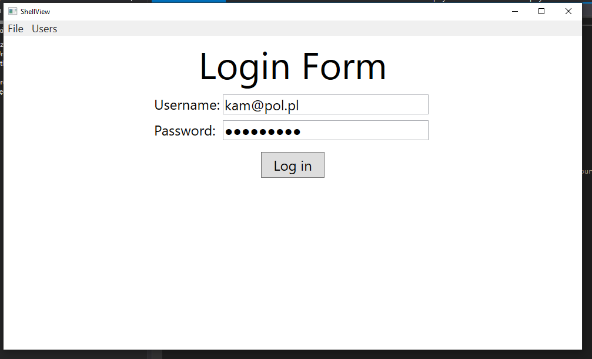
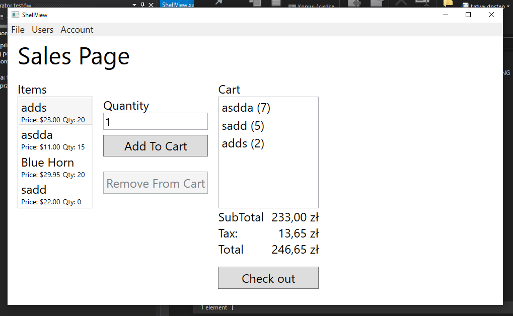
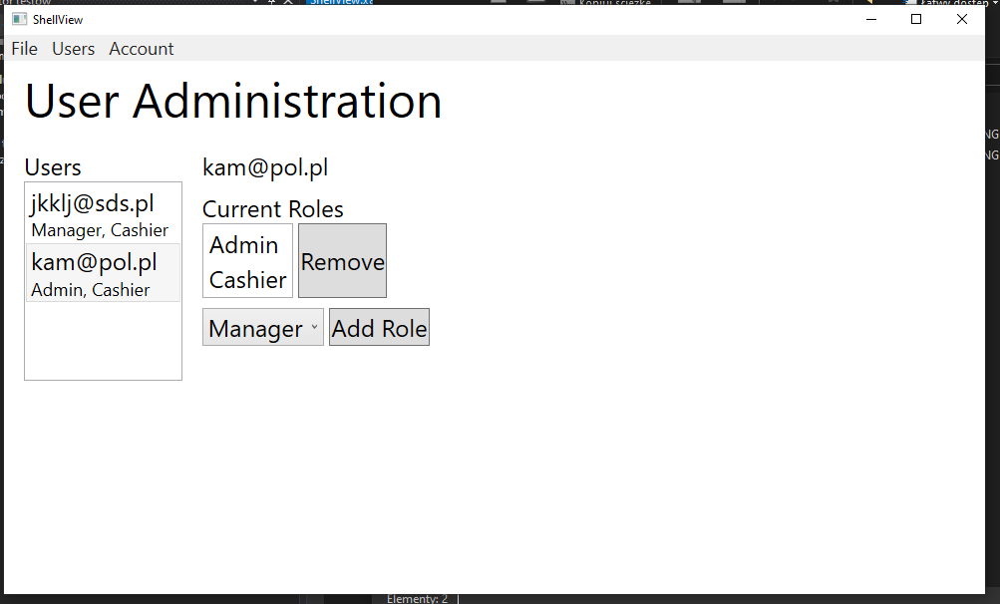

# Retail Manager
Full project – build a retail management system. Build a desktop app that runs a cash register, handles inventory, and manages the entire store. 

Project goals
-	Using modern development techniques
-	Get experience how an application grows over time
-	Using distributed version-control system Git
-	Build Minimum Viable Product that  will be expanded over time.
-	Using SQL database
-	Create WebAPI with authentication
-	Create WPF with will log into API
-	Create platform in .net framework to upgrade to .net core
      - Upgrading to .NET Core: Front-End Class Library DONE

TODO:
-     User Blazor WebAssembly PWA
-     Deckerize backend 
-     Brak off a piece as microservices 
-     Upgrade to .Net 5
